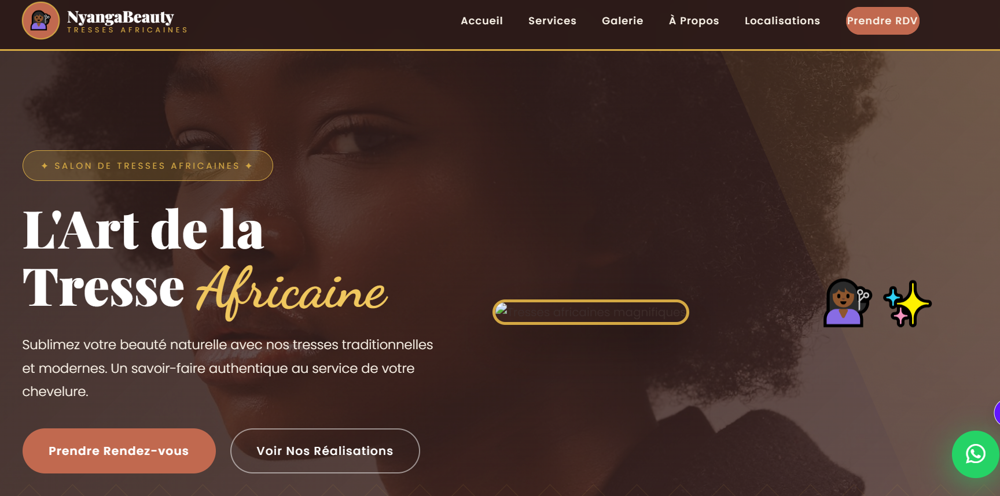

# NyangaBeauty ✨

**NyangaBeauty** est un site web moderne et élégant conçu pour un salon de coiffure spécialisé dans les tresses africaines, avec une présence en France (Paris) et en Belgique (Bruxelles).

🔗 **Lien du site en direct** : [https://joelyk.github.io/nyangabeauty/](https://joelyk.github.io/nyangabeauty/)

## 🌟 Fonctionnalités

- **Design Élégant & Traditionnel** : Une interface utilisateur qui mêle modernité et héritage culturel avec des tons terre et or.
- **Responsive Design** : Une expérience fluide sur tous les supports (Mobiles, Tablettes, Desktops).
- **Galerie Illustrée** : Présentation des différents styles de tresses (Braids, Vanilles, Cornrows, Fulani, etc.).
- **Double Localisation** : Gestion de deux points de vente (Paris & Bruxelles) avec infos de contact spécifiques.
- **Réservation WhatsApp** : Un tunnel de conversion direct vers la messagerie instantanée (+237 652027193) pour simplifier les RDV.
- **Performance & Animations** : Chargement optimisé avec loader personnalisé et animations au défilement (Scroll Reveal).

## 🛠️ Technologies Utilisées

- **Structure** : HTML5 sémantique.
- **Stylisation** : CSS3 pur (Custom Properties, Layouts Grid & Flexbox).
- **Interactivité** : JavaScript moderne (Vanilla JS, Intersection Observer API).
- **Ressources** : 
  - [FontAwesome](https://fontawesome.com/) pour les icônes.
  - [Google Fonts](https://fonts.google.com/) (Playfair Display, Poppins, Dancing Script).
  - [Unsplash](https://unsplash.com/) pour les visuels haute définition.

## 📸 Galerie de Styles

| Style | Aperçu |
| :--- | :--- |
| **Braids Classiques** |  |
| **Fulani Braids** |  |
| **Cornrows** |  |

## ✍️ Auteur

Développé avec passion par **Joel Yankam** — Fondateur de [GeniusClassrooms](https://geniusclassrooms.com).

## 📄 Licence

Ce projet est distribué sous la licence **MIT**. Voir le fichier [LICENSE](./LICENSE) pour plus d'informations.

---
*© 2024 NyangaBeauty - Sublimez votre beauté naturelle.*
